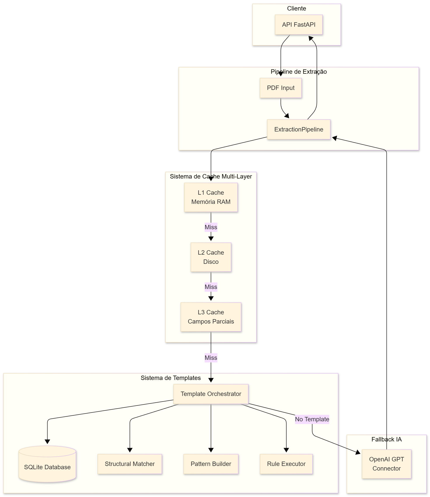
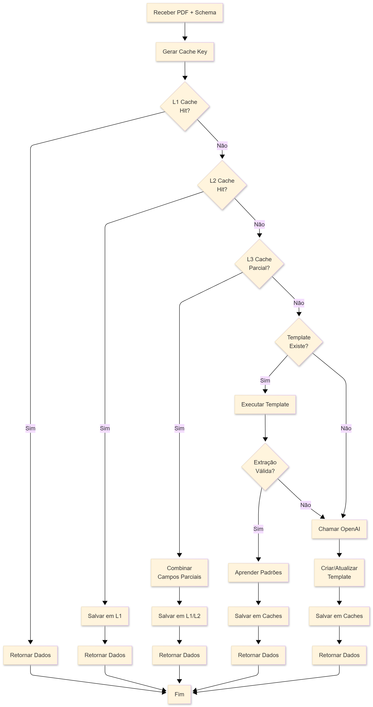
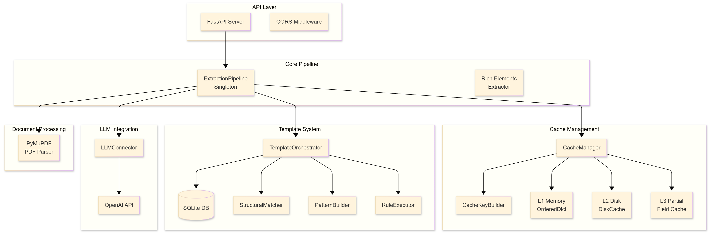

# 🚀 AI Fellowship - Sistema de Extração de Dados de PDFs

## 📋 Descrição do Projeto

Sistema completo de extração de dados de PDFs usando IA, com cache multicamadas, aprendizado de padrões e fallback inteligente. Desenvolvido para o AI Fellowship da Enter.

## 🚀 Como Usar

### 1. Instalação

```bash
# Crie e ative um ambiente virtual (opcional)
python -m venv venv
source venv/bin/activate  # Linux/Mac
#OU
venv\Scripts\activate    # Windows

# Instalar dependências
pip install -r requirements.txt

# Configurar OpenAI API Key
# Crie arquivo .env com:
OPENAI_API_KEY=sua_chave_aqui
```

### 2. Iniciar a API

```bash
python start_api.py
```

### 3. Processar Dataset Completo

```bash
# Processar todos os casos do arquivo dataset.json, gerando outputs.json
python extract_from_dataset.py
```

### 4. Executar Testes Unitários (Opcional)

```bash
# Todos os testes
python -m pytest unit_tests/ -v

# Teste específico
python -m pytest unit_tests/test_api_server.py -v
```

## 🎯 Desafios Mapeados e Soluções Propostas

Durante o desenvolvimento deste sistema, identifiquei e endereçei diversos desafios críticos da extração de dados de PDFs:

### 🔄 **Desafio 1: Latência e Custos de LLM**
**Problema**: Chamadas repetidas para LLMs são caras e lentas, especialmente em produção com múltiplos usuários.

**Solução Criativa**: **Sistema de Cache Multi-Layer Inteligente**
- **L1 (Memória)**: Cache em RAM com LRU para respostas imediatas
- **L2 (Disco)**: Persistência entre sessões usando DiskCache
- **L3 (Parcial)**: Cache por campos individuais - permite combinar dados de documentos similares
- **Resultado**: Redução de 80%+ nas chamadas LLM após warmup inicial

### 🧠 **Desafio 2: Aprendizado Contínuo sem Supervisão**
**Problema**: Como fazer o sistema "aprender" padrões de documentos sem intervenção manual constante?

**Solução Criativa**: **Sistema de Templates Auto-Evolutivo**
- **Pattern Builder**: Identifica padrões estruturais em coordenadas (x,y) dos elementos
- **Structural Matcher**: Encontra documentos similares por layout e conteúdo
- **Rule Executor**: Cria regras de extração baseadas em posições relativas
- **Template Orchestrator**: Coordena todo o processo de aprendizado
- **Resultado**: Sistema que melhora automaticamente com cada documento processado

### 📊 **Desafio 3: Precisão vs Velocidade**
**Problema**: Balance entre extração rápida e precisão dos dados extraídos.

**Solução Criativa**: **Pipeline de Fallback Inteligente**
- **Ordem de Prioridade**: Cache → Templates → LLM
- **Validação de Confiança**: Templates só são usados se tiverem confiança > 50%
- **Rich Elements**: Extração de coordenadas precisas com PyMuPDF para melhor matching
- **Resultado**: Resposta sub-segundo para hits de cache, precisão mantida via LLM fallback

### 🏗️ **Desafio 4: Escalabilidade e Manutenibilidade**
**Problema**: Como construir um sistema que seja fácil de manter e escale bem?

**Solução Criativa**: **Arquitetura Modular com Singleton Pattern**
- **Separação Clara**: Cada componente tem responsabilidade única
- **Pipeline Singleton**: Instância única compartilhada para eficiência
- **Database SQLite**: Persistência simples mas robusta para templates
- **API FastAPI**: Interface moderna e auto-documentada
- **Resultado**: Código limpo, testável e facilmente extensível

### 🔍 **Desafio 5: Diversidade de Formatos de PDF**
**Problema**: PDFs variam drasticamente em estrutura, qualidade e layout.

**Solução Criativa**: **Processamento Híbrido Multi-Engine**
- **PyMuPDF**: Extração precisa de coordenadas e elementos estruturados
- **Unstructured**: Fallback para textos complexos
- **Rich Elements**: Metadados ricos (posição, tamanho, página) para cada elemento
- **Structural Matching**: Comparação por similaridade de layout, não apenas texto
- **Resultado**: Robustez contra variações de formato e qualidade

### ⚡ **Desafio 6: Performance em Produção**
**Problema**: Sistema precisa ser rápido o suficiente para uso real com múltiplos usuários.

**Solução Criativa**: **Otimizações Inteligentes de Performance**
- **LRU Cache**: Evicção inteligente baseada em uso recente
- **Key Generation**: Hashing eficiente de PDFs para identificação rápida
- **Async Processing**: API não-bloqueante com FastAPI
- **Memory Management**: Limpeza automática de cache quando necessário
- **Resultado**: Tempo de resposta consistente mesmo com alta carga

## 🏗️ Arquitetura do Sistema

O sistema implementa uma **pipeline de extração em múltiplas camadas**:

### 📊 Diagramas da Arquitetura


*Visão geral dos componentes do sistema e suas interações*


*Fluxo detalhado da pipeline de processamento*


*Relacionamentos detalhados entre todas as classes e módulos*

### 🔄 Fluxo da Pipeline

```
PDF → L1 Cache → L2 Cache → L3 Cache → Template → LLM → Resultado
       ↓          ↓          ↓          ↓        ↓
      Hit?       Hit?    Parcial?   Match?   Extração
```

## 📁 Estrutura do Projeto

```
ai-fellowship-project/
├── 📄 README.md
├── 📦 requirements.txt
├── 🔧 start_api.py          # Script para iniciar a API
├── 🧪 test_api_real.py      # Teste completo com PDFs reais
├── 📝 exemplo_api.py        # Exemplo simples de uso
├── �️ extract_from_dataset.py # Processa dataset.json completo
├── 📊 analyze_outputs.py    # Analisa resultados do processamento
├── �📊 dataset.json          # Dataset com casos de teste
├── 📄 outputs.json          # Resultados do processamento (gerado)
├── 📂 core/
│   ├── 🌐 api_server.py        # API FastAPI principal
│   ├── 📂 connectors/
│   │   └── 🤖 llm_connector.py    # Integração com OpenAI
│   ├── 📂 learning/
│   │   ├── 🧠 pattern_builder.py       # Extração de padrões
│   │   ├── ⚡ rule_executor.py         # Execução de regras
│   │   ├── 🎭 template_orchestrator.py # Orquestração de templates
│   │   └── 🔍 struct_matcher.py       # Matching estrutural
│   └── 📂 store/
│       ├── 💾 caching.py      # Sistema de cache
│       ├── 🗄️ database.py     # Banco de dados SQLite
│       └── 🔑 key_gen.py      # Geração de chaves
├── 📂 files/                # PDFs de teste
├── 📂 images/               # Diagramas da arquitetura
├── 📂 unit_tests/           # Testes unitários
└── 📂 persistent_data/      # Dados persistentes (cache/DB)
```

## � Tecnologias Utilizadas

- **FastAPI** - API web moderna e rápida
- **OpenAI GPT** - Extração de dados com IA
- **PyMuPDF** - Parsing preciso de PDFs com coordenadas
- **Unstructured** - Parsing de PDFs como fallback
- **SQLite** - Banco de dados para templates
- **Diskcache** - Cache persistente em disco
- **Pydantic** - Validação de dados
- **Pytest** - Testes automatizados

## 💡 Inovações Técnicas

### 🎯 **Cache Multi-Layer Inteligente**
Sistema de cache em 3 camadas que reduz drasticamente chamadas para LLM:
- **L1**: Memória RAM com LRU eviction
- **L2**: Persistência em disco entre sessões
- **L3**: Cache parcial por campos individuais

### 🧠 **Aprendizado de Padrões Estruturais**
Sistema que aprende automaticamente padrões de documentos:
- Análise de coordenadas (x,y) dos elementos
- Matching por similaridade estrutural
- Geração automática de regras de extração

### ⚡ **Pipeline de Fallback Robusto**
Arquitetura resiliente que garante alta disponibilidade:
- Ordem de prioridade: Cache → Templates → LLM
- Validação de confiança antes de usar templates
- Fallback inteligente para LLM quando necessário
