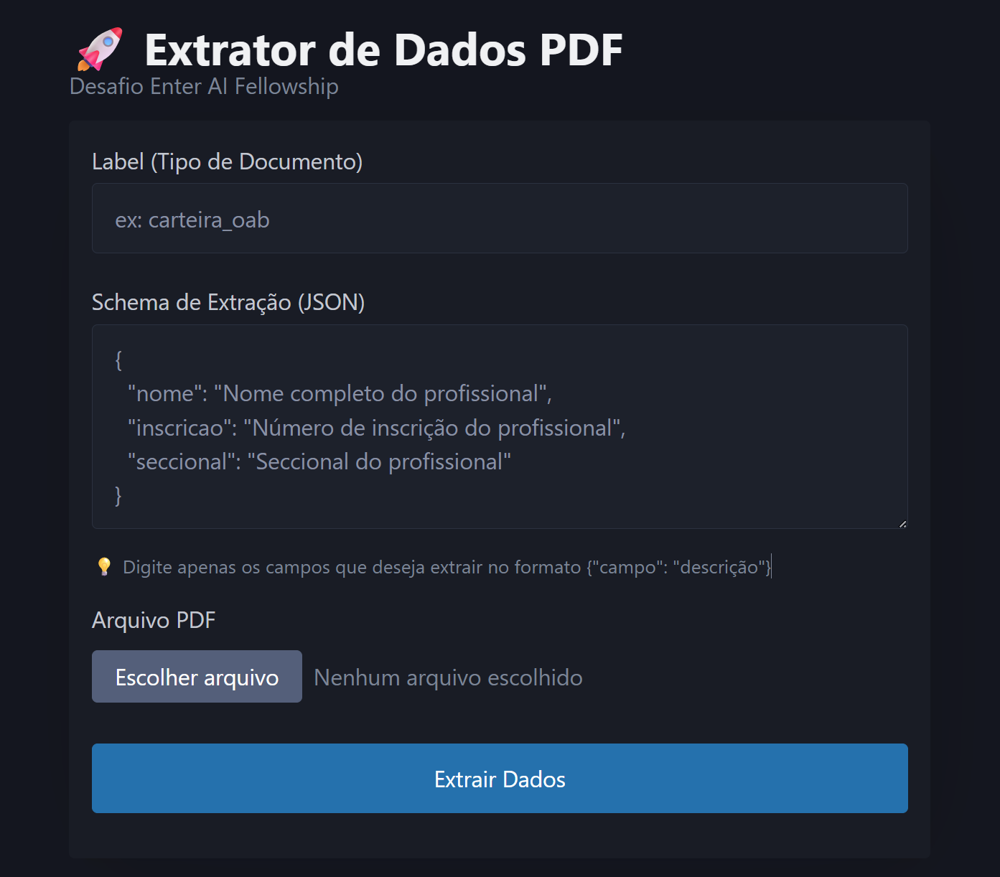
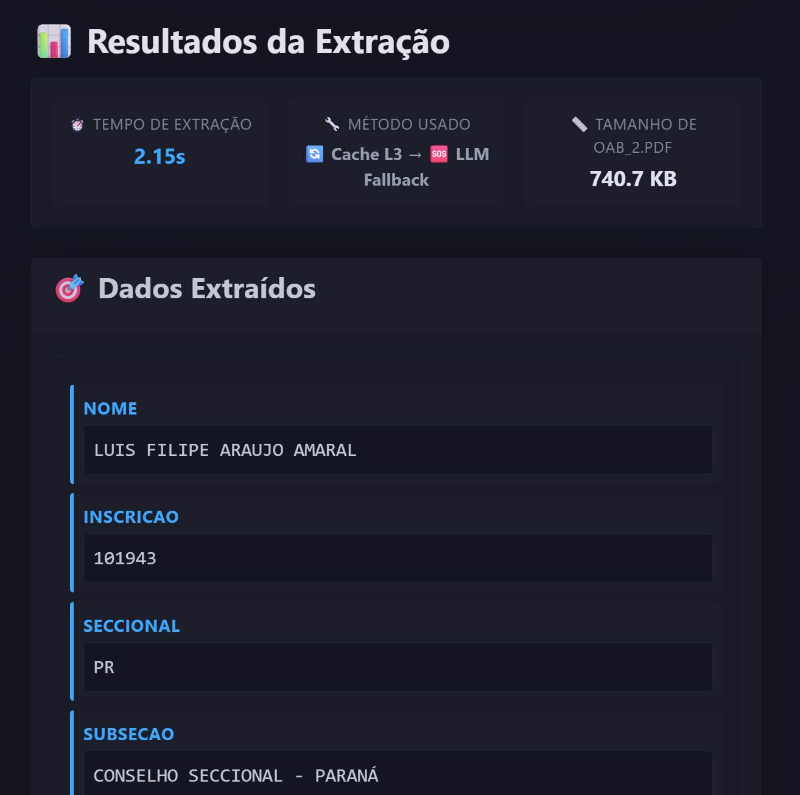
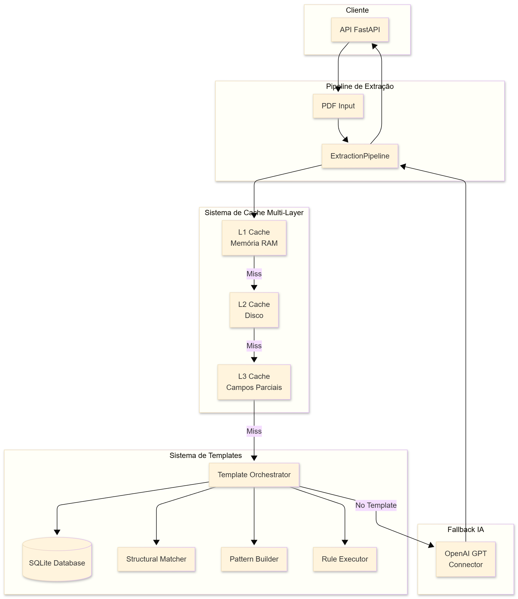
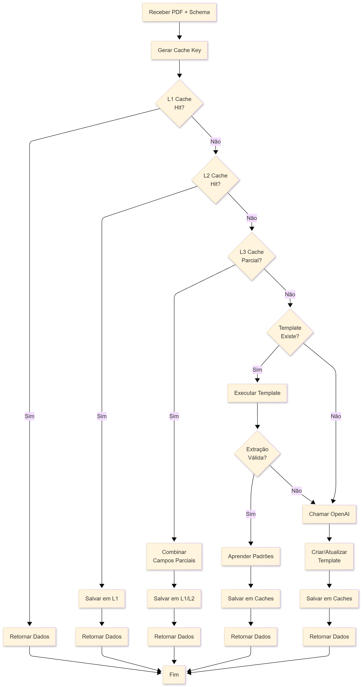
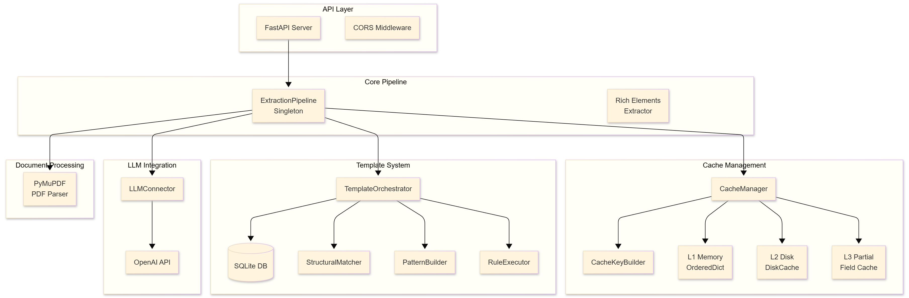

# 🚀 AI Fellowship - PDF Data Extraction System

## 📋 Project Description

Complete PDF data extraction system using AI, with multi-layer caching, pattern learning, and intelligent fallback. Developed for Enter's AI Fellowship.

## 🚀 How to Use

### 1. Installation

```bash
# Clone the repository
git clone https://github.com/Matheus-F-Scatolin/ai-fellowship-project-matheus-scatolin.git

# Access the project directory
cd ai-fellowship-project-matheus-scatolin

# Create and activate a virtual environment (optional)
python -m venv venv
source venv/bin/activate  # Linux/Mac
#OR
venv\Scripts\activate    # Windows

# Install dependencies
pip install -r requirements.txt

# Configure OpenAI API Key
# Create .env file with:
OPENAI_API_KEY=your_key_here
```

### 2. Start the API

```bash
python start_api.py
```

### 3. Use the Web Interface (UI)

After starting the API, open the `frontend/index.html` file in your browser to use the web interface:

1. **Open the UI**: Find the `frontend/index.html` file and open it in your browser
2. **Fill out the form**:
   - **Label**: Document type (e.g., `carteira_oab`)
   - **Schema**: JSON with the fields you want to extract
   - **File**: Select a PDF to process
3. **Extract Data**: Click "Extract Data" and see the formatted results

The interface is modern, responsive, and shows:
- ✨ Extracted data in an organized and readable format
- 🔧 Pipeline metadata (time, cache hits, etc.)

If you want, try sending the same PDF multiple times to see the cache effect! Additionally, after sending the same template twice, remove fields from the schema and run the extraction again to observe template learning. You can also send similar PDFs to see structural matching in action.
 
#### 📷 Interface Screenshots

Below are captures of the web interface for reference:


*Interface home screen (extraction form).*


*Example of formatted result displayed by the interface.*

### 4. Process Full Dataset
Place the dataset.json file with paths, schemas, and labels in the project root (replace the existing one) and the PDFs in the files/ folder. Then, run the script to process all PDFs:
```bash
# Open another terminal (and activate the virtual environment) and run:
python extract_from_dataset.py
```
After that, the results will appear in the terminal one by one and will be saved in outputs.json.

### 5. Run Unit Tests (Optional)

```bash
# All tests
python -m pytest unit_tests/ -v

# Specific test
python -m pytest unit_tests/test_pattern_builder.py -v
```

## 🎯 Mapped Challenges and Proposed Solutions

During the development of this system, I identified and addressed several critical challenges in PDF data extraction:

### 🔄 **Challenge 1: LLM Latency and Costs**
**Problem**: Repeated calls to LLMs are expensive and slow.

**Creative Solution**: **Intelligent Multi-Layer Cache System**
- **L1 (Memory)**: RAM cache with LRU for immediate responses
- **L2 (Disk)**: Persistence between sessions using DiskCache
- **L3 (Partial)**: Cache by individual fields - allows combining data from similar documents

### 🧠 **Challenge 2: Continuous Unsupervised Learning**
**Problem**: How to make the system "learn" document patterns without constant manual intervention?

**Creative Solution**: **Self-Evolving Template System**
- **Pattern Builder**: Identifies structural patterns of different types:

      1. Relative coordinate patterns of elements (x,y) corrected by page size
      2. Textual context patterns around fields (anchors)
      3. Regex patterns for field validation (e.g., CNPJ, dates)

- **Structural Matcher**: Finds similar documents by layout and content
- **Rule Executor**: Executes extraction rules based on learned patterns
- **Template Orchestrator**: Coordinates the entire process of learning and applying templates
- **Result**: System that automatically improves with each processed document

### 📊 **Challenge 3: Accuracy vs Speed**
**Problem**: Balance between fast extraction and accuracy of extracted data.

**Creative Solution**: **Intelligent Fallback Pipeline**
- **Priority Order**: Cache → Templates → LLM
- **Confidence Validation**: Templates are only used if they have a high degree of confidence
- **Rich Elements**: Precise coordinate extraction with PyMuPDF for better matching
- **Result**: Sub-second response for cache hits, accuracy maintained via LLM fallback

### 🏗️ **Challenge 4: Scalability and Maintainability**
**Problem**: How to build a system that is easy to maintain and scales well?

**Creative Solution**: **Modular Architecture with Singleton Pattern**
- **Clear Separation**: Each component has a single responsibility
- **Pipeline Singleton**: Single shared instance for efficiency
- **SQLite Database**: Simple but robust persistence for templates
- **FastAPI API**: Modern and self-documented interface
- **Result**: Clean, testable, and easily extensible code

## 🏗️ System Architecture

The system implements a **multi-layer extraction pipeline**:

### 📊 Architecture Diagrams


*Overview of system components and their interactions*


*Detailed flow of the processing pipeline*


*Detailed relationships between all classes and modules*


## 📁 Project Structure

```
ai-fellowship-project/
├── 📄 README.md
├── 📦 requirements.txt
├── 🔧 start_api.py          # Script to start the API
├── 📖 extract_from_dataset.py # Processes full dataset.json
├── 📊 dataset.json          # Dataset with test cases
├── 📄 outputs.json          # Processing results (generated)
├── 📂 core/
│   ├── 🌐 api_server.py        # Main FastAPI API
│   ├── 📂 connectors/
│   │   └── 🤖 llm_connector.py    # OpenAI integration
│   ├── 📂 learning/
│   │   ├── 🧠 pattern_builder.py       # Pattern extraction
│   │   ├── ⚡ rule_executor.py         # Rule execution
│   │   ├── 🎭 template_orchestrator.py # Template orchestration
│   │   └── 🔍 struct_matcher.py       # Structural matching
│   └── 📂 store/
│       ├── 💾 caching.py      # Cache system
│       ├── 🗄️ database.py     # SQLite database
│       └── 🔑 key_gen.py      # Key generation
├── 📂 frontend/             # User web interface
│   ├── 🌐 index.html        # Main UI page
│   ├── 🎨 style.css         # Styles and responsive design
│   └── ⚡ app.js            # Interface JavaScript logic
├── 📂 files/                # Test PDFs
├── 📂 images/               # Architecture diagrams
├── 📂 unit_tests/           # Unit tests
└── 📂 persistent_data/      # Persistent data (cache/DB)
```

## ⚙️ Technologies Used

- **FastAPI** - Modern and fast web API
- **OpenAI GPT** - AI-powered data extraction
- **PyMuPDF** - Precise PDF parsing with coordinates
- **SQLite** - Database for templates
- **Diskcache** - Persistent disk cache
- **Pydantic** - Data validation
- **Pytest** - Automated testing
- **HTML/CSS/JavaScript** - Responsive web interface construction

## 💡 Technical Innovations

### 🎯 **Intelligent Multi-Layer Cache**
3-layer cache system that reduces LLM calls:
- **L1**: RAM memory with LRU eviction
- **L2**: Disk persistence between sessions
- **L3**: Partial cache by individual fields

### 🧠 **Structural Pattern Learning**
System that automatically learns document patterns:
- Analysis of element coordinates (x,y)
- Matching by structural similarity
- Automatic generation of extraction rules

### ⚡ **Robust Fallback Pipeline**
Resilient architecture that ensures high availability:
- Priority order: Cache → Templates → LLM
- Confidence validation before using templates
- Intelligent fallback to LLM when necessary
